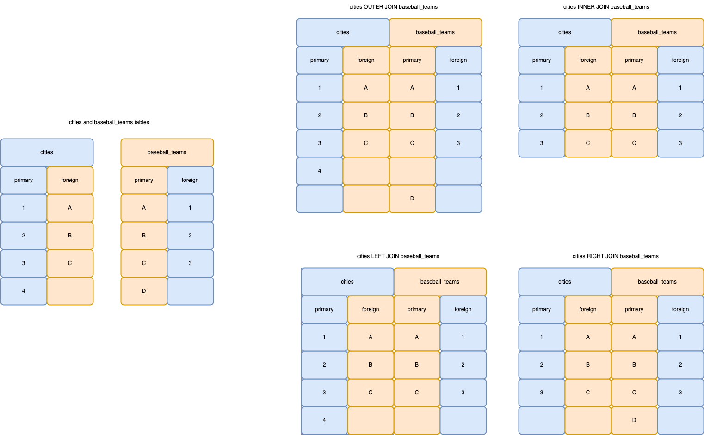

# 07 Chapter 4 Lab Notes
## 2023-02-27

```
select * from takes;
select * from student;

-- this gets all Comp. Sci. students and then
-- adds a row in takes where course_id == "ZZZZZZZ",
-- sec_id == 1, semester == "Fall", and year == 2017
-- for each student using a nested subquery
INSERT INTO takes (ID, course_id, sec_id, semester, year)
SELECT ID, "ZZZZZZZ", 1, "Fall", 2017 FROM student
where dept_name = "Comp. Sci.";

select * from takes;
```


```
-- this gets all students who have the
-- same department and tot_cred as
-- the student Zhang
SELECT * FROM student
WHERE dept_name IN
(SELECT dept_name FROM student
WHERE name = "Zhang")
AND tot_cred IN
(SELECT tot_cred FROM student
WHERE name = "Zhang");

SELECT * FROM student
WHERE dept_name IN
(SELECT dept_name FROM student
WHERE name = "Zhang"
OR name = "Chavez"
)
```


